# Session K screenshots (review only; never merge)

Review screenshots for [PR #58](https://github.com/reyals1111-ux/ZIGoals/pull/58). This branch has no app code and shares no history with `main`.

**How they were taken (local):**
- Production builds (`PUBLIC_ALPHA_UNDEPLOYED`):
  - `c189313`, which is main and Alpha deploy #21 (**before**);
  - the PR's Part 6 commit `54e9d98` (**after**; later commits change no app page).
- Showcase demo data, reduced motion, `/api/**` answered by a 503 fixture.
- Chromium 141 headless, at device scale factor 2.
- Each image is the end of the desktop sidebar: the last navigation item, the figure, the planet with its star and, after, the words on the planet.

## Sidebar marks (Part 6), 1440 × 900: before and after
On the five life pages the figure is pixel-identical above the planet (0 differing pixels), and its words now sit larger on the planet. The six other pages showed the "ZIGoals" wordmark and now show exactly Today's swan.

| Page | Before | After |
|---|---|---|
| Today (swan) | 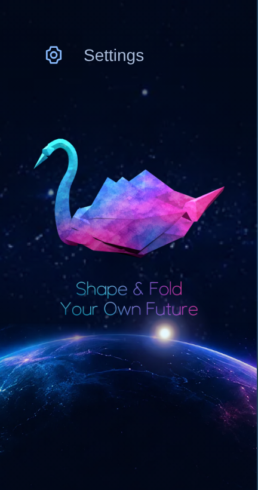 | 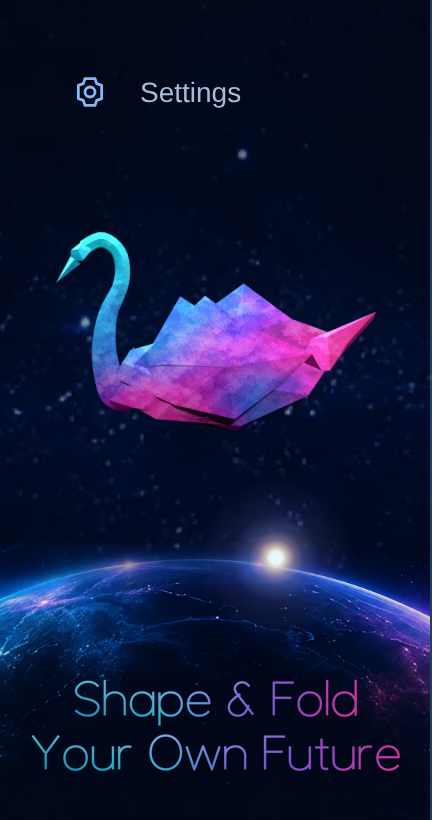 |
| Goals (lotus) |  | 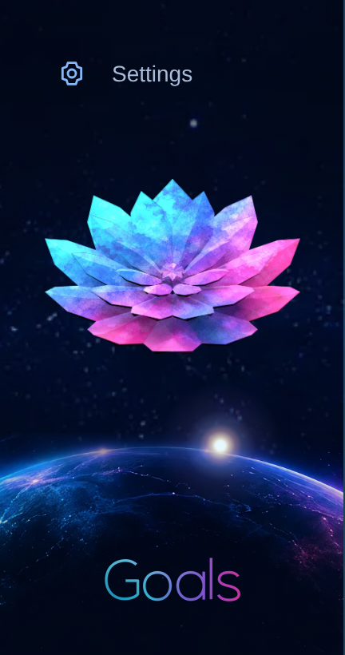 |
| Habits (butterfly) | 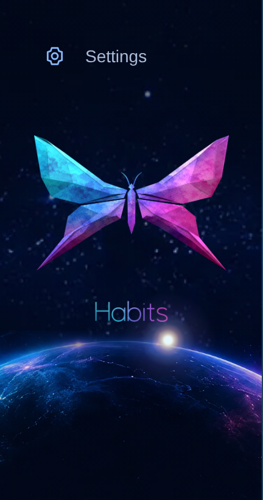 | 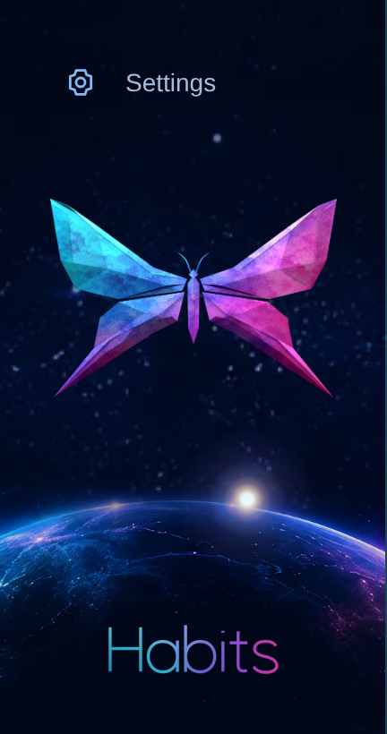 |
| Health (heart) | 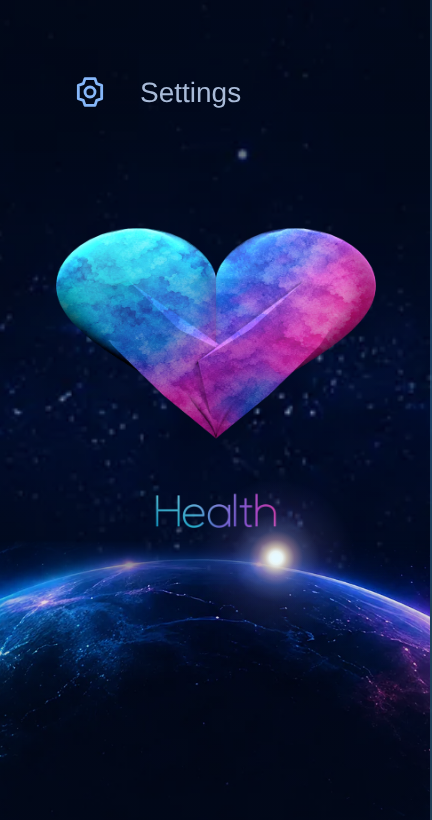 | 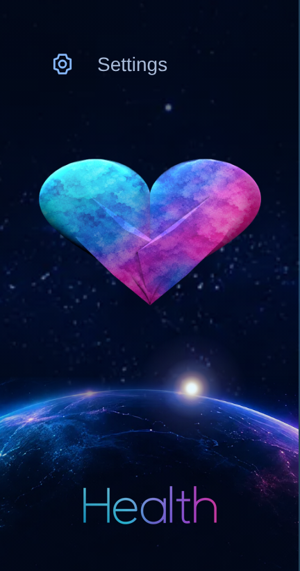 |
| Wealth (bull) | 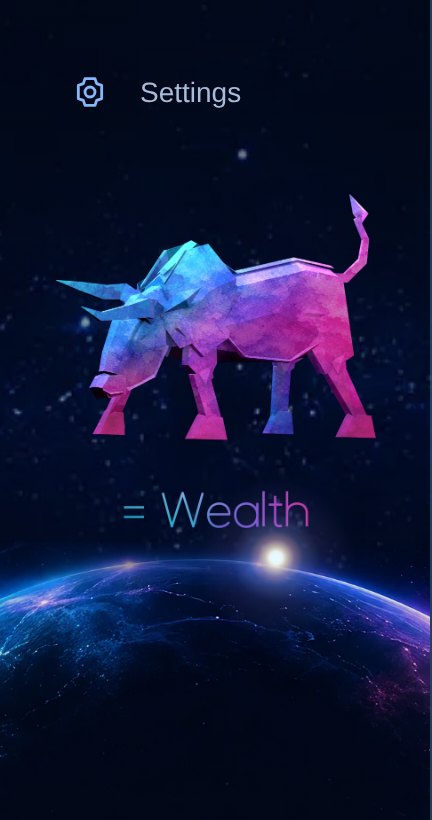 | 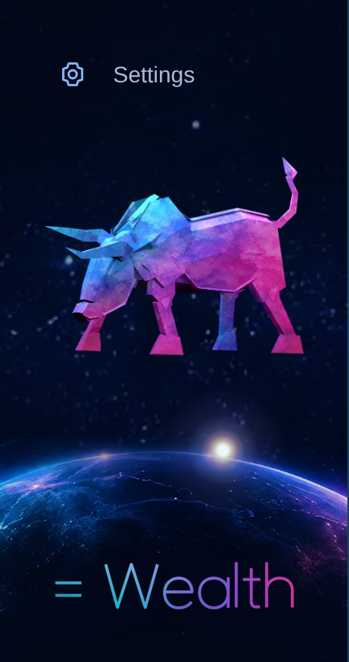 |
| Markets |  |  |
| Staking | 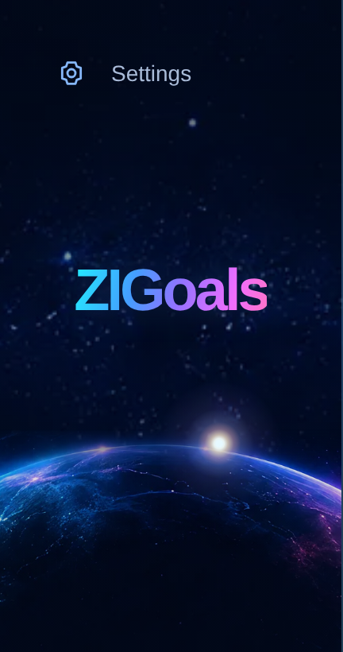 |  |
| Portfolio |  |  |
| Ecosystem |  |  |
| Activity | 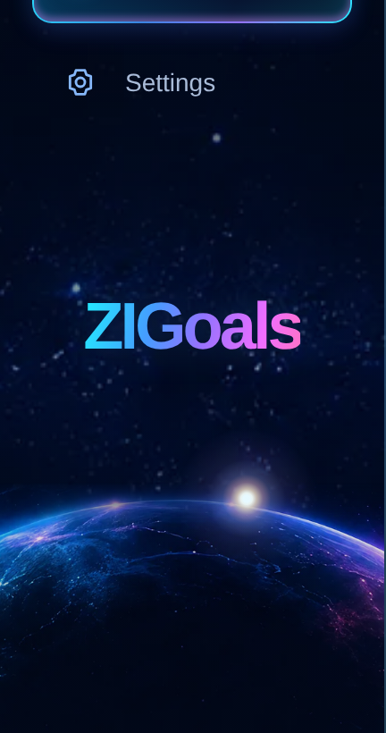 | 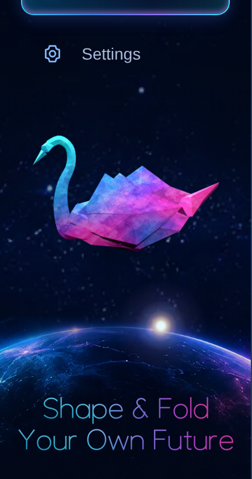 |
| Settings | 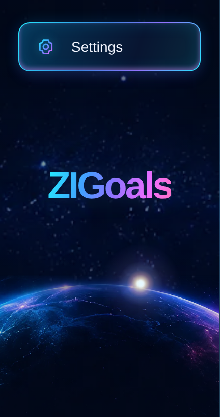 | 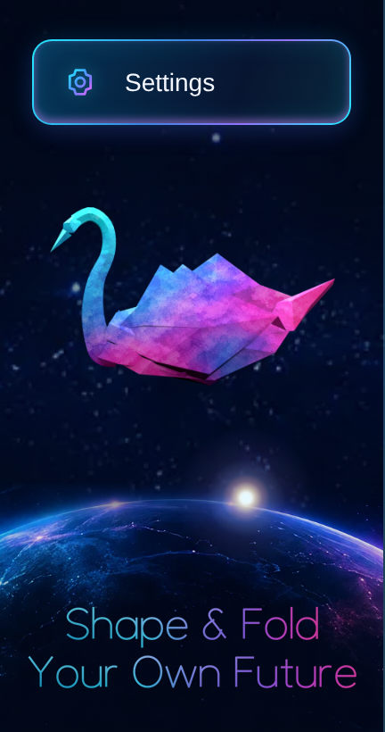 |

## Other sizes (after)
Each size shows the five marks and one page that shows the swan. 1280×640, 1440×600 and 1024×600 are short windows, where the sidebar scrolls; these images show its end.

- **1024×768:** [today](sidebar/1024x768/today-after.png), [goals](sidebar/1024x768/goals-after.png), [habits](sidebar/1024x768/habits-after.png), [health](sidebar/1024x768/health-after.png), [wealth](sidebar/1024x768/wealth-after.png), [markets](sidebar/1024x768/markets-after.png)
- **1280×720:** [today](sidebar/1280x720/today-after.png), [goals](sidebar/1280x720/goals-after.png), [habits](sidebar/1280x720/habits-after.png), [health](sidebar/1280x720/health-after.png), [wealth](sidebar/1280x720/wealth-after.png), [markets](sidebar/1280x720/markets-after.png)
- **1180×820:** [today](sidebar/1180x820/today-after.png), [goals](sidebar/1180x820/goals-after.png), [habits](sidebar/1180x820/habits-after.png), [health](sidebar/1180x820/health-after.png), [wealth](sidebar/1180x820/wealth-after.png), [markets](sidebar/1180x820/markets-after.png)
- **1920×1080:** [today](sidebar/1920x1080/today-after.png), [goals](sidebar/1920x1080/goals-after.png), [habits](sidebar/1920x1080/habits-after.png), [health](sidebar/1920x1080/health-after.png), [wealth](sidebar/1920x1080/wealth-after.png), [markets](sidebar/1920x1080/markets-after.png)
- **1280×640:** [today](sidebar/1280x640/today-after.png), [goals](sidebar/1280x640/goals-after.png), [habits](sidebar/1280x640/habits-after.png), [health](sidebar/1280x640/health-after.png), [wealth](sidebar/1280x640/wealth-after.png), [markets](sidebar/1280x640/markets-after.png)
- **1440×600:** [today](sidebar/1440x600/today-after.png), [goals](sidebar/1440x600/goals-after.png), [habits](sidebar/1440x600/habits-after.png), [health](sidebar/1440x600/health-after.png), [wealth](sidebar/1440x600/wealth-after.png), [markets](sidebar/1440x600/markets-after.png)
- **1024×600:** [today](sidebar/1024x600/today-after.png), [goals](sidebar/1024x600/goals-after.png), [habits](sidebar/1024x600/habits-after.png), [health](sidebar/1024x600/health-after.png), [wealth](sidebar/1024x600/wealth-after.png), [markets](sidebar/1024x600/markets-after.png)

## Landing, `prefers-contrast: more` (Part 7)
The landing page (`landing/`), Chromium at device scale 2, reduced motion. "More contrast" is the system setting `prefers-contrast: more`, emulated. Only what was dim changes: the "/" separator in the hero line, and the footer's small print and spark. Nothing moves.

| Where | Default | More contrast |
|---|---|---|
| Hero line, 1440 | 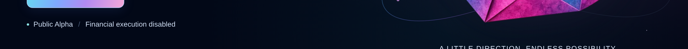 |  |
| Footer, 1440 | 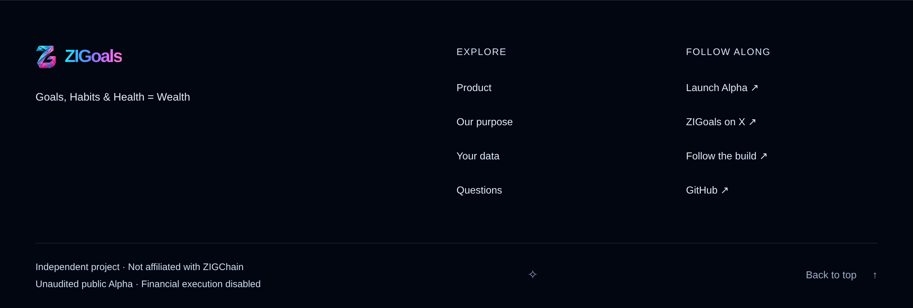 | 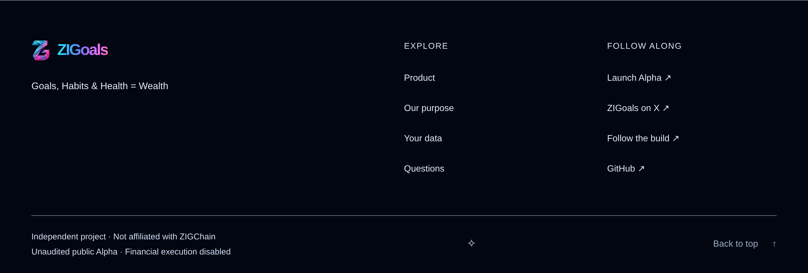 |
| Hero line, 390 | 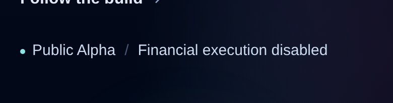 | 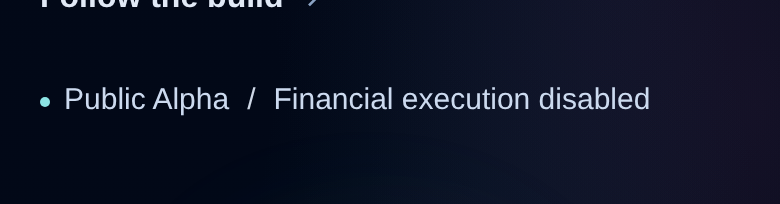 |
| Footer, 390 | 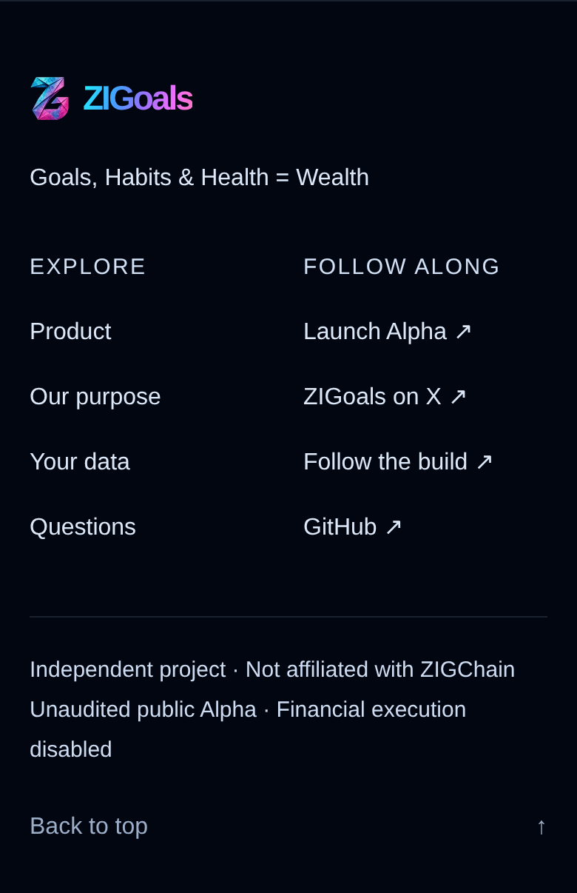 | 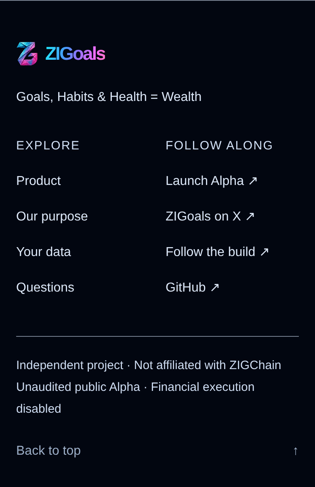 |
