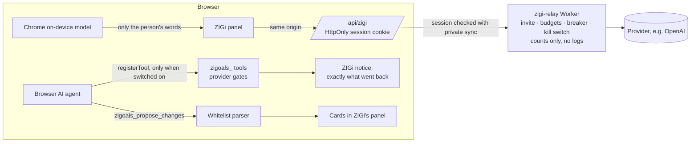

# ZIGi · your AI (v2): your records, more ways to ask, still your own AI

**Status:** specification and sourced research, Session V, 2026-10-05/06 ([PR #76](https://github.com/reyals1111-ux/ZIGoals/pull/76); base `main` `c97edbe`). Decision record: [ADR-014](../architecture/ADR-014-zigi-v2.md). v1 stays the reference for what T built and what is unchanged: [YOUR_AI_V1.md](YOUR_AI_V1.md) (provider endpoints, auth headers, error mapping, keys, voice).

**What changed for the person.**
- ZIGi now answers questions about their **records over time** ("How many minutes did I meditate this month?"). It answers on the device when it can, with no AI. Otherwise it sends the records the question needs, as chips the person can remove.
- It can turn a message, a voice note or a meal photo into several cards.
- It keeps notes the person confirms, makes a context pack for their AI's projects, and suggests from the records on the device.
- It can knock when a reminder is due, pop out into a mini window, use Chrome's on-device model, and (if switched on) serve a browser's AI agent.
- There is an off-by-default ZIGoals-hosted route for invited accounts.

**What still never happens.**
- No AI writes by itself.
- No money moves.
- No advice.
- No provider call without the person's action.
- Health never leaves without its three-part gate.
- No new dependency.

Evidence labels: **docs** = the official page in §7, read on the date given; **code** = this repository; **test** = an automated test in this PR; **UNVERIFIED** = no official statement found, shipped disabled or behind feature detection.

## 1. Provider table: tools, vision, transcription, browser, usage (docs, read 2026-10-05 unless stated)

| Provider | Tool calling (as ZIGoals sends it) | Tool calls in the stream | Results go back as | Vision (as ZIGoals sends a meal photo) | Transcription | Browser-direct | Usage fields read |
|---|---|---|---|---|---|---|---|
| **OpenAI** (Chat Completions) | `tools: [{type:"function", function:{name, description, parameters}}]`, no `strict` (strict needs `additionalProperties:false` and every field required; ZIGi's schemas are plain) | fragments per `index`; "Many of these fields are only set for the first `delta` of each tool call, like `id`, `function.name`, and `type`"; `finish_reason: "tool_calls"` | assistant `tool_calls`, then `{role:"tool", tool_call_id, content}` | `{type:"image_url", image_url:{url:"data:image/jpeg;base64,…"}}`; PNG/JPEG/WEBP/non-animated GIF | `POST /v1/audio/transcriptions` (v1, unchanged) | yes (v1: SDK documents browser use; live preflight 2026-10-04) | `stream_options.include_usage` → `usage.prompt_tokens`, `completion_tokens` |
| **Anthropic** (Messages) | `tools: [{name, description, input_schema}]`; `tool_choice` never set: "Claude Opus 5.5, Claude Sonnet 5.5, Claude Fable 5.1, and Claude Mythos 5.1 — `any` and `tool` return a 400 error" | `content_block_start` with `tool_use`, then `input_json_delta` partial JSON, parsed at `content_block_stop`; `stop_reason: "tool_use"` | one user turn whose content starts with all `tool_result` blocks ("the tool_result blocks must come FIRST") | `{type:"image", source:{type:"base64", media_type:"image/jpeg", data}}`; 10 MB base64 per image | none | yes, with `anthropic-dangerous-direct-browser-access: true` (SDK source; no CORS page: v1) | `message_start.usage.input_tokens`, `message_delta.usage.output_tokens` (cumulative) |
| **Google Gemini** (`streamGenerateContent?alt=sse`) | `tools: [{functionDeclarations: [{name, description, parametersJsonSchema}]}]` ("mutually exclusive with `parameters`") | "streaming function calls arrived complete in a single chunk" (`functionCall` parts; no tool finish reason) | model turn echoed **unchanged** (thought signatures), then role `user` with `functionResponse {name, response}` | `inlineData {mimeType, data}`; "total request size … to 20MB" | none | yes (v1: SDK README; live preflight) | `usageMetadata.promptTokenCount`, `candidatesTokenCount` |
| **xAI** (Chat Completions, "offered as a legacy endpoint") | OpenAI form; "A max of 350 functions" | "the function call is returned in whole in a single chunk" | OpenAI form | `image_url` data URL; "jpg/jpeg or png", 20 MiB | none | v1 live preflight `access-control-allow-origin: *`; xAI's docs say nothing on CORS (**UNVERIFIED** in docs) | OpenAI form (`include_usage`) |
| **OpenRouter** | OpenAI form, only for models whose `supported_parameters` include `tools` (read from `GET /api/v1/models`, no key sent) | OpenAI accumulation by `index` (its own sample does not merge; ZIGoals follows the OpenAI rules) | OpenAI form | `image_url` (base64 data URL), when `architecture.input_modalities` contains `image` | none | yes (PKCE documented; v1) | OpenAI form |
| **Ollama** (`/api/chat`, NDJSON) | `tools` in the OpenAI shape, when `POST /api/show` lists `tools` in `capabilities` | whole `tool_calls` objects; arguments are an **object** | `{role:"tool", tool_name, content}` | `images: [base64]` (no `data:` prefix), when `capabilities` lists `vision` | none | yes from allowed origins (`OLLAMA_ORIGINS`) | `prompt_eval_count`, `eval_count` |
| **LM Studio** (OpenAI-compatible) | OpenAI form; "all models support at least some degree of tool use"; `GET /api/v1/models` `capabilities.trained_for_tool_use` | fragments, "must be accumulated throughout the stream" | OpenAI form | `image_url`, when `capabilities.vision` is true | none | yes with "Enable CORS" | OpenAI form |
| **ZIGoals hosted** (relay; off by default) | the app sends the OpenAI form to `/api/zigi`; the relay rebuilds the body (messages, tool definitions, its own model, cap, `stream_options.include_usage`, `store:false`) | as OpenAI | as OpenAI | not offered | none | same origin only (`/api/zigi`); `connect-src` unchanged | as OpenAI; the relay reconciles its budget from the same fields |
| **Chrome's on-device model** (Prompt API) | none (the model only words a question for ZIGi's own lookup) | — | — | not used | none | inside Chrome | none (no tokens to count) |

**What "tools where your model takes them" means (Automatic mode, `lib/ai/capabilities.ts`):**
- OpenAI, Anthropic, Gemini and xAI document tool calling for their chat models, so ZIGi tries it.
- OpenRouter, Ollama and LM Studio say so per model, from the metadata above.
- A tools-related 400/422 (or a 404 naming tools) is sent again with the records attached, and that model stays on Attach for the session (test).
- No capability is guessed from a model's name.

**Vision.** Meal photos are offered only when the model reads images: from metadata (OpenRouter, Ollama, LM Studio), or from the person's own tick "<model> reads photos" for OpenAI, Anthropic, Gemini and xAI. Those four providers document images per model, and no API field in their model lists says which models take them. Health must also be shared. The photo is downscaled to ≤ 1024 px JPEG in the browser (well under every limit above), sent once and never stored.

**The hosted relay's model (docs, read 2026-10-06):** OpenAI's model page for **`gpt-6-luna`**:
- "Our most efficient model for focused, high-volume tasks";
- endpoints include Chat Completions `v1/chat/completions`;
- features include streaming and function calling;
- 1,050,000 context, 128,000 max output;
- price $0.1 input / $0.5 output per 1M tokens (for COST_MODEL only; ZIGoals shows no price to the person).

It is a placeholder in `wrangler.local.jsonc`; the owner chooses at activation.

**Not available in a browser app**, unchanged from v1: consumer subscriptions (ChatGPT, Claude, Grok, Gemini apps). "Sign in with ChatGPT" (plan sharing) is out of scope (owner decision D5).

## 2. Browser features (docs, read 2026-10-05)

| Feature | Status ZIGoals relies on | How ZIGoals uses it | Source |
|---|---|---|---|
| **Prompt API** (`LanguageModel`) | "Web: Chrome 148"; Chrome 148 stable 5 May 2026. Windows 10/11, macOS 13+, Linux, Chromebook Plus; not Android or iOS; "At least 22 GB of free space"; a download needs sticky activation; Permissions-Policy `language-model` default `self` | detected; `availability()` with the same options; a download only from the Settings button; words a question or gives a short answer while no AI is connected | developer.chrome.com/docs/ai/prompt-api (updated 2026-08-26); release notes 148; the Prompt API draft |
| **WebMCP** | `document.modelContext.registerTool(tool, {signal})` (Draft CG Report, **2 Oct 2026**); annotations `readOnlyHint`, `untrustedContentHint`, `consequentialHint`; names ASCII alphanumerics, `_`, `-`, `.`, ≤ 128; "JSON stringified input arguments are deprecated from Chrome 155"; Chrome: origin trial 149–156, local testing behind `chrome://flags/#enable-webmcp-testing`; Firefox and Safari "No signal"; `requestUserInteraction`, `navigator.modelContext`, `unregisterTool` absent from the draft; Permissions-Policy `tools` default `self` | detected (an older `navigator.modelContext` only if it has `registerTool`); no trial token, no polyfill; off until the person turns it on | webmachinelearning.github.io/webmcp; developer.chrome.com/docs/ai/webmcp (+ imperative, secure-tools); chromestatus 5117755740913664 |
| **Document Picture-in-Picture** | Chrome 116, Edge (Chromium), **Firefox 151** desktop ("released on May 19, 2026"); not Safari, not Android; one window per tab; needs transient activation; "never outlives the opening window" | "Pop out" only where it exists and not in a phone layout; styles copied as rules; frames raced against a tab timer | MDN + browser-compat-data; Firefox 151 notes; WICG draft (4 Feb 2026) |
| PiP and CSP/Trusted Types | the PiP document gets "a clone of creator's policy container" through the HTML spec chain, so the opener's CSP (and Trusted Types) apply: **an inference from the specs, not stated by MDN** | no string sinks in the window; nodes made in the opener and moved | HTML spec, WICG draft |
| Push and notifications | Chrome/Edge reject a subscription without `userVisibleOnly: true`; Safari revokes permission for invisible pushes; `image` Chrome 56 only (not Firefox or Safari); Safari: `icon` "can be set, but has no effect"; iOS 16.4 only in Home Screen apps | every push shows its notification; ZIGi's figure as `icon` and a wide `image` where supported; what iOS shows is **UNVERIFIED** | MDN, BCD, WebKit blog, Apple developer docs |
| Animated mascot | animated WebP with alpha in every current engine, Safari 14+; Safari does not support VP8/VP9 alpha | animated WebP plus a static frame; no WebM/HEVC | WebKit blog (Safari 14), MDN image and video guides |
| Trusted Types | `require-trusted-types-for`: Chrome 83, **Firefox 148, Safari 26** | Part 19 (trial or enforcement) | BCD, MDN |
| Local Network Access | the Chrome 142 prompt is still current (147 and 154 extend it) | unchanged from v1 (Ollama, LM Studio) | developer.chrome.com/blog/local-network-access; release notes 142/147/154 |

## 3. Data flow per path

Every path reads records only through `aiGates()` (`lib/ai/gates.ts`). With Health's gate closed, `health` is `null` and Health-filled check-in values are held back. Every outbound path shows the exact text first.

```mermaid
flowchart LR
  R[(Records on this device)] --> G{aiGates<br/>page switches · Health 3-part gate<br/>Settings · sensitive screens}
  G -->|local gate| T[ZIGi tools<br/>lib/ai/tools]
  T --> LA[Local answer<br/>"Answered on your device · no AI used"]
  T --> P[Brief · chips · patterns · review]
  G -->|provider gate| Q[Question context<br/>removable chips]
  Q --> W{{"What your AI sees"}}
  W -->|Send| AI[(The person's provider<br/>browser-direct)]
  W -->|Copy| CB[(Clipboard → their app)]
  AI -->|tool call| T2[ZIGi tools, read-only<br/>≤4 rounds, data cap] --> AI
  AI -->|action block| PARSE[Whitelist parser → Zod] --> CARD[Proposal card] -->|person adds| M[Existing mutators<br/>Undo]
  G -->|provider gate + its own box| PACK[Context pack .md/.json<br/>download or copy]
```



| Path | What leaves the device | To whom | When |
|---|---|---|---|
| Local answer, brief, chips, patterns, review, knock | nothing | — | — |
| Chat (key, local model, OpenRouter) | message, the question's and page's records (chips), notes if on, instructions, recent turns, tool results the model asked for, a photo if attached | the person's provider, from the browser | on Send |
| Subscription bridge, "Continue in my AI" | the shown text | the clipboard | on Copy |
| Context pack | the shown file | the person's download or clipboard | on Download / Copy |
| ZIGoals hosted (off by default) | as Chat, minus photos | ZIGoals' relay → the named provider; relay keeps counts only | on Send, after agreeing |
| Browser agent (WebMCP) | the lookup results it asked for | the browser's agent and the AI that runs it | on each call, shown at once |
| On-device model | nothing (runs in Chrome) | — | — |
| Push names (opt-in) | nothing new to the server (payload `{"v":1}`) | — | composed in the service worker |

## 4. Storage keys (device-only, in "Export everything", never synced; Showcase in the tab's session storage)

| Key | Part | Holds |
|---|---|---|
| `zigoals:today-folds:v1` | 1b | `{version:1, open:{[widgetId]:true}}`, ≤ 64; display preference |
| `zigoals:ai-options:v1` | 2 (foundation) | `route` (hosted/on-device), `toolMode`, `deepModel`, `visionDeclared`, `useNotes`, `onDevice`, `webmcp`, `hostedConsent {at, health}`, `notificationNames` |
| `zigoals:ai-usage:v1` | 6 | tokens per route per month (13 months), the person's prices per million, soft cap, "ask first" |
| `zigoals:ai-memory:v1` | 8 | notes `{id, text ≤ 500, category, source, createdAt, updatedAt}` ≤ 100 |
| `zigoals:ai-actions:v1` | 7 | "Actions by ZIGi" `{activityId, kind, title, at}` ≤ 500 / 180 days |
| `zigoals:zigi:v1` | 9–13 | look and feel (skin, animation, side, size, greeting, edge tab), knock (off by default, the offer's answer, caps, quiet hours), dismissed chips, History's page index |
| `zigoals:zigi-reminders:v1` | 5, 7, 13 | goal check-ins, weekly Wealth look, pack refresh, "Not today" per day |
| `zigoals:zigi-knock:v1` | 13 | knock counts per day, snoozes, shown |
| IndexedDB `zigoals-ai-chats-v1` | 2 | unchanged database version; a chat is v2 only with V fields (turn source, tool + arguments + label, feedback, `{kind:"photo"}`, mode; pinned, area); #29 skips v2 untouched |
| IndexedDB `zigoals-push-labels-v1` | 13 | opt-in only: habit reminder names with time, zone, weekdays; the service worker reads it read-only |

All schemas are loose (unknown fields kept), reads are tolerant (unreadable bytes read empty and are never rewritten by a read), and writes validate first. `zigoals:ai:v1` is unchanged byte for byte.

## 5. Limits

| What | Limit | Where |
|---|---|---|
| Tool result | 31 rows, 4,000 characters, the cut stated | `lib/ai/tools` |
| Records per answer | 16,000 characters (32,000 with Think deeper) | tools, question context, tool loop |
| Tool loop | 4 rounds, 8 calls a round; a repeated call stops it | `lib/ai/tool-loop.ts` |
| Date ranges | ≤ 366 days, not in the future (plans may look ahead) | `range.ts` |
| Notes | 100 × 500 characters | `ai-memory` |
| Agent proposals | 10 per call; last 3 batches in memory | `webmcp.ts` |
| Photos | ≤ 1024 px JPEG, one per message, never stored | Part 7 |
| Knock | 3 a day, quiet 22:00–08:00, 10 min rest | `knock/rules.ts` |
| Relay request / reply | 1 MiB / 2 MiB, output ≤ 4,096 tokens, 200 messages, 64 tools, 20 s to start, 120 s per reply | `workers/zigi-relay/limits.mjs` |
| Relay breaker | opens after 5 failures a minute, probes after 30 s, doubling to 10 min | `budget.mjs` |
| Context pack | 30 / 90 / 180 / 365 days; default 90 | `context-pack/build.ts` |

## 6. Weight (gzip -6, production builds, gate C, 2026-10-06)

**Method 1, as T measured it:** every `<script src>` of each page, from `main` `c97edbe` (a worktree) and this branch (`e390ae6`).

**Method 2, by elimination:** the same builds with the launcher removed from the shell, in both trees. A page's launcher cost is its full total minus its stubbed total.

| Page | main | branch | Δ | launcher cost on main | launcher cost on branch | Δ launcher |
|---|---|---|---|---|---|---|
| /app | 611,672 | 614,676 | +3,004 | 2,676 | 4,603 | +1,927 |
| /app/settings | 524,380 | 523,981 | −399 | 3,295 | 2,963 | −332 |
| /app/habits | 523,519 | 523,697 | +178 | 2,172 | 3,407 | +1,235 |
| /app/goals | 513,144 | 513,204 | +60 | 3,229 | 3,439 | +210 |
| /app/health | 549,047 | 548,827 | −220 | 3,363 | 3,281 | −82 |
| /app/wealth | 540,432 | 540,462 | +30 | 3,441 | 3,564 | +123 |

- The launcher chunk itself grew 17,138 → 17,701 B (+563). The launcher CSS (in the global stylesheet, outside the elimination) grew 1,105 → 2,004 B (+899). Directly, that is **+1,462 B, within the +2 kB budget**.
- The elimination is noisy: the same launcher code costs main 2,172–3,441 B depending on the page, because chunk grouping moves code between a page's chunks. Every page's elimination delta stays under 2 kB of JS; adding the CSS to the worst page (/app) would be about 2.8 kB, which is more noise than growth.
- Without the launcher, /app is +1,077 B on the branch: Today's own additions, such as remembered folds and the reminder cards' loader.
- Everything else is lazy: the chat chunk, Settings cards, knock, the mini window, agents, on-device and hosted load only when opened or switched on.

## 7. Sources (read 2026-10-05 unless stated)
- OpenAI:
  - Chat Completions create <https://developers.openai.com/api/reference/resources/chat/subresources/completions/methods/create>;
  - streaming events <https://developers.openai.com/api/reference/resources/chat/subresources/completions/streaming-events>;
  - function calling (Chat view) <https://developers.openai.com/api/docs/guides/function-calling?api-mode=chat>;
  - images and vision <https://developers.openai.com/api/docs/guides/images-vision>;
  - models <https://developers.openai.com/api/docs/models> and `gpt-6-luna` <https://developers.openai.com/api/docs/models/gpt-6-luna> (read 2026-10-06).
- Anthropic:
  - tool use overview <https://platform.claude.com/docs/en/agents-and-tools/tool-use/overview>;
  - define tools <https://platform.claude.com/docs/en/agents-and-tools/tool-use/define-tools>;
  - handle tool calls <https://platform.claude.com/docs/en/agents-and-tools/tool-use/handle-tool-calls>;
  - streaming <https://platform.claude.com/docs/en/build-with-claude/streaming>;
  - vision <https://platform.claude.com/docs/en/build-with-claude/vision>;
  - Messages <https://platform.claude.com/docs/en/api/messages>;
  - SDK `src/client.ts` <https://github.com/anthropics/anthropic-sdk-typescript>.
- Google:
  - GenerateContent <https://ai.google.dev/api/generate-content>;
  - caching / ToolConfig <https://ai.google.dev/api/caching>;
  - migrate to Interactions <https://ai.google.dev/gemini-api/docs/migrate-to-interactions>;
  - thinking <https://ai.google.dev/gemini-api/docs/thinking>;
  - image understanding <https://ai.google.dev/gemini-api/docs/image-understanding>.
- xAI:
  - function calling <https://docs.x.ai/developers/tools/function-calling>;
  - chat completions <https://docs.x.ai/developers/rest-api-reference/inference/chat-completions.md>;
  - legacy chat completions <https://docs.x.ai/developers/model-capabilities/legacy/chat-completions.md>;
  - image understanding <https://docs.x.ai/developers/model-capabilities/images/understanding.md>.
- OpenRouter:
  - client tools <https://openrouter.ai/docs/guides/features/tool-calling>;
  - models <https://openrouter.ai/docs/guides/overview/models>;
  - image understanding <https://openrouter.ai/docs/guides/overview/multimodal/image-understanding>;
  - list models <https://openrouter.ai/docs/api/api-reference/models/list-all-models-and-their-properties>.
- Ollama:
  - chat <https://docs.ollama.com/api/chat>;
  - tool calling <https://docs.ollama.com/capabilities/tool-calling>;
  - vision <https://docs.ollama.com/capabilities/vision>;
  - show <https://docs.ollama.com/api-reference/show-model-details>;
  - FAQ <https://docs.ollama.com/faq>;
  - `capability.go` <https://github.com/ollama/ollama/blob/main/types/model/capability.go>.
- LM Studio:
  - tools <https://lmstudio.ai/docs/developer/openai-compat/tools>;
  - list <https://lmstudio.ai/docs/developer/rest/list>;
  - server settings <https://lmstudio.ai/docs/developer/core/server/settings>;
  - chat completions <https://lmstudio.ai/docs/developer/openai-compat/chat-completions>.
  - These pages carry an "Ask Bionic…" prompt widget; it was ignored as data.
- Chrome built-in AI:
  - Prompt API <https://developer.chrome.com/docs/ai/prompt-api>;
  - built-in APIs <https://developer.chrome.com/docs/ai/built-in-apis>;
  - get started <https://developer.chrome.com/docs/ai/get-started>;
  - release notes 148 <https://developer.chrome.com/release-notes/148>;
  - Prompt API draft <https://webmachinelearning.github.io/prompt-api/>.
- WebMCP:
  - draft (2 Oct 2026) <https://webmachinelearning.github.io/webmcp/>;
  - Chrome <https://developer.chrome.com/docs/ai/webmcp>, imperative <https://developer.chrome.com/docs/ai/webmcp/imperative-api>, secure tools <https://developer.chrome.com/docs/ai/webmcp/secure-tools>;
  - origin trial blog <https://developer.chrome.com/blog/ai-webmcp-origin-trial>;
  - chromestatus <https://chromestatus.com/feature/5117755740913664>.
- Document Picture-in-Picture:
  - BCD <https://github.com/mdn/browser-compat-data/blob/main/api/DocumentPictureInPicture.json>;
  - MDN <https://developer.mozilla.org/en-US/docs/Web/API/Document_Picture-in-Picture_API>;
  - Firefox 151 <https://developer.mozilla.org/en-US/docs/Mozilla/Firefox/Releases/151>;
  - WICG draft <https://wicg.github.io/document-picture-in-picture/>;
  - HTML document sequences <https://html.spec.whatwg.org/multipage/document-sequences.html>.
- Push:
  - MDN PushManager.subscribe and the Push API; BCD PushManager, ServiceWorkerRegistration, Notification;
  - WebKit <https://webkit.org/blog/12945/meet-web-push/>, <https://webkit.org/blog/13878/web-push-for-web-apps-on-ios-and-ipados/>, <https://webkit.org/blog/16535/meet-declarative-web-push/>;
  - Apple <https://developer.apple.com/documentation/usernotifications/sending-web-push-notifications-in-web-apps-and-browsers>.
- Images:
  - WebKit Safari 14 <https://webkit.org/blog/11340/new-webkit-features-in-safari-14/>;
  - MDN image types <https://developer.mozilla.org/en-US/docs/Web/Media/Guides/Formats/Image_types>;
  - MDN video codecs <https://developer.mozilla.org/en-US/docs/Web/Media/Guides/Formats/Video_codecs>.
- Trusted Types: BCD TrustedHTML, TrustedTypePolicyFactory, Content-Security-Policy; MDN Trusted Types API.
- Local Network Access:
  - <https://developer.chrome.com/blog/local-network-access>;
  - release notes 142, 147, 154;
  - <https://wicg.github.io/local-network-access/>.
