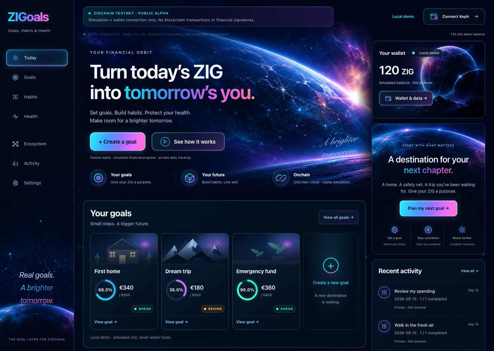

# V2.1 owner visual review

**[FINAL Today · 1440](today-1440-viewport.png)** · **[BEFORE Today](before-v2.png)** · **[FINAL Today · mobile](today-390-viewport.png)** · [Habits](habits-1440.png) · [Health](health-1440.png)



[Full Today](today-1440.png) · [Full mobile Today](today-390.png) · [320 × 800](today-320-viewport.png) · [Goals](goals-1440.png) · [Goal detail](goal-detail-1440.png) · [Mobile Habits](habits-390.png) · [Mobile Health](health-390.png) · [Owner's final mockup](owner-reference.png)

These final screenshots come from clean implementation **`bd5cf393aebebfddfa6f64dbfc3c1a0274855aa5`**, in a local production Next preview. They contain fictional Local Demo fixtures, never owner data or actual wallet balances. The application does not auto-seed them. The before image and canonical reference are the owner's supplied files; their financial examples are visual references, not application state.

Three desktop passes addressed artwork/composition, shared-background continuity and the final responsive crop. A tablet overflow of 6px was traced to an expanded decorative pseudo-element, corrected to the actual gutter, and retested. All nine routes fit 1440/1280/768/390/320×800; reduced motion is respected. [Screenshot hashes](screenshots.json), [validation](validation.json), [static asset checks](static-assets.json) and [artwork provenance](../../design/V21_ARTWORK.md) are retained.

| Owner correction | Final treatment | State |
| --- | --- | --- |
| 01 Selected navigation | Cyan glow, blue edge, violet/magenta lower light; only current section luminous | COMPLETE |
| 02 Repeated progress colors | Stable Goal/Habit ID palettes; semantic status remains separate | COMPLETE |
| 03 Nebula text | Cyan → blue → violet → magenta/pink, restrained warm tip | COMPLETE |
| 04 Recent Activity | Luminous type-specific icons, distinct local/private labels | COMPLETE |
| 05 Wallet card | Reference-guided planet, full rim, real balance/state, premium account link | COMPLETE |
| 06 Hero controls/pillars | Bright primary, glass secondary/play ring; Your goals / Your future / Onchain | COMPLETE |
| 07 Destination | Reference-guided globe, HTML title/CTA, three journey icons | COMPLETE |
| 08 Quote removal | Removed; wallet is first in the desktop rail | COMPLETE |
| 09 Sidebar | Starfield and lower planetary horizon | COMPLETE |
| 10 Hero | Cinematic blue horizon and magenta flare, blended into environment | COMPLETE |
| 11 Footer | Shared local horizon and gradient wordmark | COMPLETE |
| 12 Flat background | Replaced with shared starfield, depth and selective nebula surfaces | COMPLETE |
| 13 Compact connector | Gradient icon, glass edge, real connected address/balance, chevron, focus/hover | COMPLETE |
| 14 Habits + Health | Shared spectrum, varied cadence/macros, calm readable surfaces | COMPLETE |
| 15 Wordmark | Dominant gradient ZIGoals text | COMPLETE |
| 16 Temporary logo | No new logo exploration; existing replaceable mark/favicon retained, removed from sidebar emphasis | COMPLETE |
| 17 Goal illustrations | Approved simplified home/mountain/garden SVGs retained | COMPLETE |

The wallet connection handler is unchanged. The connected chevron is decorative; the tooltip names its existing connection-refresh action, with no invented dropdown menu. Local Demo shows simulated funds and its own badge; a real connected view shows Testnet and the real truncated address/balance. No onchain integration or financial action was enabled. The hero's Onchain pillar explicitly labels the vision and Alpha simulation.

Review the after/before/reference, then Today, Habits and Health on phone. [PR #9](https://github.com/reyals1111-ux/ZIGoals/pull/9) stays **open, unmerged and undeployed**. Photo recognition, wearable sync, AI, cloud sync and all other Run 7 deferrals remain unchanged. The owner still needs to approve the visual result.

To reproduce the local fictional gallery after a production build and local preview:

```sh
PLAYWRIGHT_BASE_URL=http://127.0.0.1:3109 RUN7_CAPTURE=1 pnpm --filter @zigoals/web exec playwright test product-visual.spec.ts --output=/tmp/zigoals-v21-review
```
