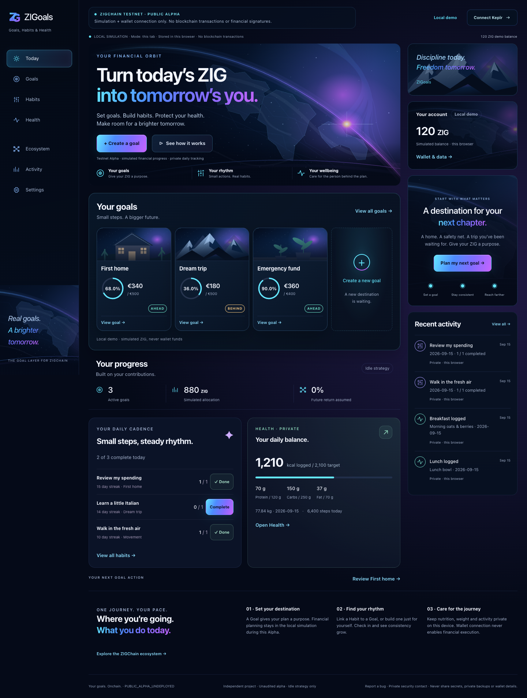

# Run 7 visual review

**[Today · 1440](today-1440.png)** · **[Today · 390](today-390.png)** · [320px](today-320.png)

[Goals](goals-1440.png) · [Goal detail](goal-detail-1440.png) · [Create Goal](create-goal-1440.png) · [Habits](habits-1440.png) · [Health](health-1440.png) · [Activity](activity-1440.png) · [Settings](settings-1440.png) · [Ecosystem](ecosystem-1440.png)

[Mobile Habits](habits-390.png) · [Mobile Health](health-390.png) · [Three original ZG concepts](../../brand/run7/concepts.png)



These screenshots show **fictional local review fixtures**, never owner data or live balances. Financial state is Local Demo; EUR uses the application's existing demo valuation. Health and Habit examples are private browser records created only by the test fixture. Runtime never seeds these examples. The selected temporary mark is **Orbit Weave**.

The source was `6889ffe7510dda8d4f7394eb1a5016121bd804b3`, rendered in a local production Next preview. The following test-only selector commit did not change runtime code. PNG checksums and byte sizes are recorded in `screenshots.json`. All nine product routes fit 1440, 1280, 768, 390 and 320×800 without document overflow. Screenshots disable decorative motion for deterministic comparison; ordinary controls/animations retain reduced-motion support.

Three substantive passes: (1) empty Today composition against the reference, (2) populated Goal cards and enhanced horizon/artwork, (3) production capture after mobile spacing, compact streak controls, styled filters and guided-form refinement. The reference's atmosphere and hierarchy are recreated as original vector/CSS art, not photoreal raster assets.

To recreate the same local-only review fixtures, run a local production preview, then:

```bash
PLAYWRIGHT_BASE_URL=http://127.0.0.1:3110 RUN7_CAPTURE=1 pnpm --filter @zigoals/web exec playwright test product-visual.spec.ts --output=/tmp/zigoals-run7-visual
```

Review the orbit mark, hero scale, Goal cards, Habit completion/history and Health diary/targets on desktop and phone. Check the empty state in a fresh browser profile. Connect Keplr only if you choose to verify the existing explicit connection behavior; no financial signing or broadcasting is enabled. This PR does not deploy or merge anything.
